## features 
1. main features is sync data from database(support postgres)
2. guarantee sync data and consider batch atomic in one commit 
3. consider multiple tables relation ship and consider N +1 problem  with config  file to spec data source (support custom sql) and destination 

## pattern
- +increasment: 
  - in time series with time syncpoint record on metadata
  - support rabbitmq batch read, we can pressume payload as parameters to sql like {"user_id": 1} mapping to sql: where user_id = :user_id
- manual config the custom sql to face to production operations

## sync configuration for support some  common strategy pattern for below write operation
操作名稱,核心行為,在架構中的表現
APPEND,僅增加新資料。,最簡單的流程。TaskWriter 直接將新 Batch 交給 Splitter 分流後寫入新檔案。
OVERWRITE,刪除舊檔案或舊分區，並寫入新資料。,會產生新的 DataFile，並在 Metadata 中標記舊檔案為已刪除。
UPDATE / DELETE,修改或刪除現有行。,最複雜。需要定位舊資料位置，並決定是直接重寫整個檔案，還是產生「刪除檔」（Delete File）。
MERGE INTO,根據條件決定是 INSERT、UPDATE 還是 DELETE。,結合了上述所有流程，通常需要先進行 Join 來判斷每筆資料的去向。

## TODO

### implement the todo phase 1
- consider the partition data from options include database layer and application layer
- [iceberg_cli_dev_todo](iceberg_cli_dev_todo.html)

## ask user if you need access any internet sit url for example rust crate api docs
